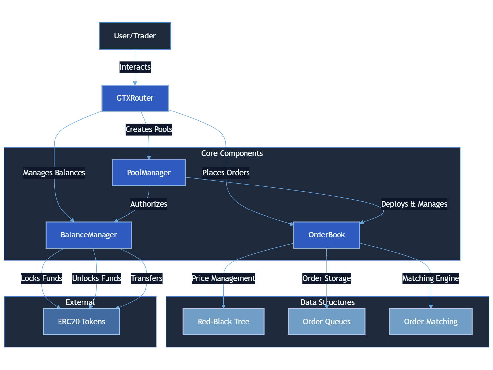

# 🚀 Great Trading eXperience

## 🌎 Overview

GTX is a decentralized finance (DeFi) protocol designed to enable permissionless **spot trading**, with plans to expand into perpetual markets in the future. Addressing inefficiencies in Automated Market Makers (AMMs) and centralized exchanges, GTX provides an order book-based, permissionless trading experience that is **fair, efficient, and scalable**.

## ❌ Problems with Traditional AMMs

- **🔄 Inefficient Capital Utilization** – AMMs require deep liquidity to minimize slippage, leading to inefficient capital allocation.
- **💰 High Impermanent Loss** – Liquidity providers often suffer from impermanent loss due to volatile price movements.
- **📉 Price Manipulation** – AMMs are vulnerable to front-running and sandwich attacks, harming traders.
- **🚧 Restricted Market Listings** – Centralized exchanges limit listings, making it difficult for emerging assets to gain liquidity.

## ✅ GTX Solution for Spot Trading

GTX introduces a **Central Limit Order Book (CLOB)-based DEX** with:

1. **🌐 Decentralized Market Creation** – Anyone can list a spot trading pair without permission.
2. **📊 Efficient Order Book Trading** – CLOB enables traders to set limit orders and achieve fair price execution.
3. **🤖 AMM-Free Model** – Eliminates impermanent loss risks by relying on direct peer-to-peer trading.
4. **📡 Oracle-Free Spot Trading** – Uses an order book mechanism to ensure transparent and decentralized price discovery.

## 🔥 Key Features

- **💱 Spot Trading** – Fully decentralized CLOB-based exchange.
- **🚀 Permissionless Market Creation** – No gatekeepers—anyone can list a new market.
- **🔍 Fair and Transparent Pricing** – No reliance on external oracles for spot trades.
- **📈 Optimized Liquidity Utilization** – Capital-efficient trading mechanism compared to AMMs.
- **⚡ High-Frequency Trading Ready** – Supports traders placing orders with minimal delay.
- **🛑 No Liquidity Providers (LPs) Needed** – Orders are matched peer-to-peer, removing LP dependency.

## 🏗️ System Architecture

The CLOB DEX system consists of four main components:
- **🔍 Router** - Entry point for all user interactions
- **⚡ Order Matching Engine** – Executes spot trades based on an efficient CLOB system.
- **💾 Decentralized Order Book** – Ensures transparency and removes reliance on centralized entities.
- **🔄 Peer-to-Peer Settlement** – On-chain settlement guarantees security and transparency.

## 🔄 How It Works

1. **👨‍💻 Traders** place buy/sell orders on the decentralized order book.
2. **📊 Order Matching** occurs through a fair and efficient matching engine.
3. **💰 Protocol** earns trading fees when orders are matched in the order book.
4. **🔄 Settlement** happens directly on-chain, ensuring security and transparency.

## 🔑 Contract Addresses

### 📜 Deployed Contracts on RiseLabs Testnet

- **OrderBook Contract**
  - **Address:** `0x92D8387421fe5205051C82E4a6473E0aC5cc636b`
  - [View on Explorer](https://testnet-explorer.riselabs.xyz/address/0x92D8387421fe5205051C82E4a6473E0aC5cc636b)

- **BalanceManager Contract**
  - **Address:** `0xf997fBd9747841513d26d895072a7f35e5125cfc`
  - [View on Explorer](https://testnet-explorer.riselabs.xyz/address/0xf997fBd9747841513d26d895072a7f35e5125cfc)

- **PoolManager Contract**
  - **Address:** `0x2A61148905eA1cf87f352249DD92215C8eA0fdD5`
  - [View on Explorer](https://testnet-explorer.riselabs.xyz/address/0x2A61148905eA1cf87f352249DD92215C8eA0fdD5)

- **GTXRouter Contract**
  - **Address:** `0xe0eCBC144f924bD5bA7C7D9b373795EFA2F3589B`
  - [View on Explorer](https://testnet-explorer.riselabs.xyz/address/0xe0eCBC144f924bD5bA7C7D9b373795EFA2F3589B)

### 🪙 Mock Token Addresses

- **Mock USDC Contract**: [0x02950119C4CCD1993f7938A55B8Ab8384C3CcE4F](https://testnet-explorer.riselabs.xyz/address/0x02950119C4CCD1993f7938A55B8Ab8384C3CcE4F)
- **Mock WETH Contract**: [0xb2e9Eabb827b78e2aC66bE17327603778D117d18](https://testnet-explorer.riselabs.xyz/address/0xb2e9Eabb827b78e2aC66bE17327603778D117d18)
- **Mock WBTC Contract**: [0xc2CC2835219A55a27c5184EaAcD9b8fCceF00F85](https://testnet-explorer.riselabs.xyz/address/0xc2CC2835219A55a27c5184EaAcD9b8fCceF00F85)
- **Mock Chainlink Contract**: [0x24b1ca69816247Ef9666277714FADA8B1F2D901E](https://testnet-explorer.riselabs.xyz/address/0x24b1ca69816247Ef9666277714FADA8B1F2D901E)
- **Mock PEPE Contract**: [0x7FB2a815Fa88c2096960999EC8371BccDF147874](https://testnet-explorer.riselabs.xyz/address/0x7FB2a815Fa88c2096960999EC8371BccDF147874)

